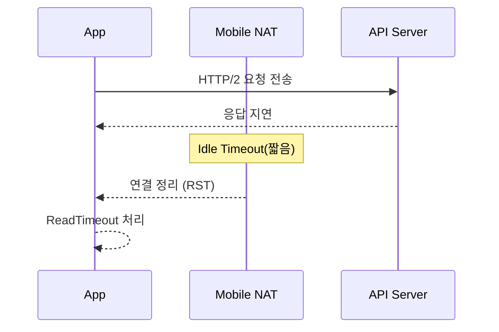

## 목차 {#toc}
- [배경/문제 상황](#background)
- [증상/분석](#symptoms)
  - [관찰된 로그](#symptoms-logs)
  - [초기 가설](#symptoms-hypotheses)
- [원인 파악](#root-cause)
  - [가설 검증 표](#root-cause-table)
  - [시퀀스](#root-cause-sequence)
- [해결 방법](#solution)
  - [공식 문서 요약](#solution-rfc)
  - [조치 내용](#solution-actions)
- [댓글 예시](#sample-comments)
- [정리](#summary)

## 배경/문제 상황 {#background}
모바일 데이터 환경에서만 `API Timeout`이 간헐적으로 발생했습니다.
와이파이에서는 재현이 되지 않아, 저희는 네트워크 특성 차이부터 의심했습니다.

즉,
**문제는 특정 네트워크에서만 드러나는 비대칭 장애**
였습니다.

저희 팀은 동일한 앱 버전과 동일한 서버 환경에서 네트워크만 바꿔가며 비교하기로 했습니다.
이 과정에서 동일 요청을 반복해 재현 패턴을 만들었습니다.

## 증상/분석 {#symptoms}
모바일 데이터에서만 요청이 일정 시간 이후 응답 없이 끊겼고, 앱은 `Timeout`으로 처리했습니다.
반대로 와이파이에서는 같은 시간대에도 정상 응답을 받았습니다.

### 관찰된 로그 {#symptoms-logs}
아래는 동일한 요청이 와이파이에서는 성공했지만 모바일 데이터에서 실패했을 때의 요약 로그입니다.
로그는 비교에 필요한 핵심만 남겼습니다.

```text
# 1) 모바일 데이터
Request: GET /v1/profile
Result: ReadTimeout after 30s

# 2) Wi-Fi
Request: GET /v1/profile
Result: 200 OK in 420ms
```

이 단계에서의 결론은 “서버 응답 자체가 느린 것이 아니라 연결이 중간에서 끊긴다”였습니다.
따라서 연결 경로의 상태를 확인해보기로 했습니다.

### 초기 가설 {#symptoms-hypotheses}
저희는 다음과 같은 가설을 세웠습니다.
이후 각 가설을 검증할 수 있는 지표와 실험 조건을 정리했습니다.

1. 서버 CPU 스파이크로 특정 시간대에만 타임아웃이 발생한다.
2. CDN 또는 게이트웨이에서 `아이들 타임아웃(Idle Timeout)`이 짧게 설정되어 있다.
3. 모바일 네트워크의 `네트워크 주소 변환(NAT, Network Address Translation)` 구간에서 연결이 정리된다.

저는 특히 2번과 3번이 더 그럴듯하다고 봤습니다.
그래서 해당 가설을 우선순위로 두고 실험을 진행했습니다.

## 원인 파악 {#root-cause}
### 가설 검증 표 {#root-cause-table}
| 가설 | 확인 방법 | 결과 |
| --- | --- | --- |
| 서버 CPU 스파이크 | 서버 지표/로그 비교 | 타임아웃 구간에도 CPU 안정적 |
| 게이트웨이 Idle Timeout | 설정값 확인 | 60초 이상으로 유지 |
| 모바일 NAT 연결 정리 | 동일 요청 재시도 간격 변경 | 간격이 길수록 실패율 증가 |

즉,
**모바일 NAT 구간의 짧은 연결 유지 정책이 핵심 원인**
이었습니다.

### 시퀀스 {#root-cause-sequence}
아래는 실제로 저희가 관찰한 흐름을 단순화한 시퀀스입니다.
원인 지점을 강조하기 위해 핵심 흐름만 표시했습니다.



이 단계에서의 결론은 “애플리케이션 레벨에서 주기적인 신호가 필요하다”였습니다.
따라서 연결 유지 방식(Keepalive)을 적용해보기로 했습니다.

## 해결 방법 {#solution}
`아이들 타임아웃(Idle Timeout)`은 일정 시간 데이터가 오가지 않으면 연결을 정리하는 정책입니다.
모바일 네트워크의 NAT 구간에서는 이 시간이 더 짧을 수 있어, 대기 요청이 쉽게 끊길 수 있습니다.

### 공식 문서 요약 {#solution-rfc}
RFC 7540(HTTP/2)은 `PING` 프레임을 통해 연결 상태를 확인할 수 있다고 설명합니다.
저희는 이 점을 근거로, 앱에서 주기적인 핑(PING)을 보내 연결을 유지하기로 했습니다.

결과적으로,
**HTTP/2의 PING을 활용해 모바일 네트워크의 Idle Timeout을 우회**
하는 방향으로 정리했습니다.

### 조치 내용 {#solution-actions}
다음은 클라이언트 측 조치 예시입니다.
설명 목적이므로 일부 값은 예시로 설정했습니다.

1. 앱에서 HTTP/2 연결 유지 간격을 20초로 설정했습니다.
2. 재시도는 지수 백오프(Exponential Backoff)로 제한했습니다.
3. 장애 감지 시 즉시 연결을 재수립하도록 했습니다.

```kotlin
// 1) HTTP/2 연결 유지 간격 설정
val client = OkHttpClient.Builder()
  .pingInterval(20, TimeUnit.SECONDS) // 모바일 NAT 타임아웃 대비
  .build()

// 2) 재시도 간격(간단 예시)
fun nextDelayMillis(attempt: Int): Long {
  // 1초, 2초, 4초, 8초...
  return 1000L * (1 shl attempt)
}
```

저희는 위와 같이 설정한 뒤, 모바일 데이터에서도 타임아웃이 현저히 줄어드는 것을 확인했습니다.
다만, “모든 환경에서의 최선”이라고 단정하기는 어렵고, 통신사별 네트워크 정책에 따라 추가 튜닝이 필요할 수 있습니다.

## 댓글 예시 {#sample-comments}
- **독자 A**: “모바일 NAT가 이렇게 빨리 끊길 수 있다는 점이 인상적이었습니다. 좋은 정리 감사합니다.”
- **독자 B**: “저희는 핑 대신 애플리케이션 하트비트(Heartbeat)를 썼는데 비슷한 효과가 있었습니다.”
- **독자 C**: “게이트웨이 타임아웃을 먼저 의심했는데, 방향 전환 과정이 도움이 됐습니다.”
- **독자 D**: “통신사별로 Idle Timeout이 다를 수 있다는 점이 공감됐습니다.”
- **독자 E**: “테스트 재현 시나리오를 먼저 만들었다는 부분이 특히 도움이 됐습니다.”

## 정리 {#summary}
- 모바일 데이터 환경에서는 `아이들 타임아웃(Idle Timeout)`이 예상보다 짧을 수 있습니다.
- RFC 7540의 `PING` 프레임 개념을 기반으로 연결 유지 전략을 설계할 수 있습니다.
- 원인 파악 단계에서 실패한 가설도 명확히 기록하면 재현과 공유가 쉬워집니다.
- 이번 조치는 현재 환경에서의 최선이지만, 네트워크 정책 변화에 따라 개선 여지가 있습니다.

혹시 더 좋은 접근 방식이 있다면 댓글로 공유 부탁드립니다!
