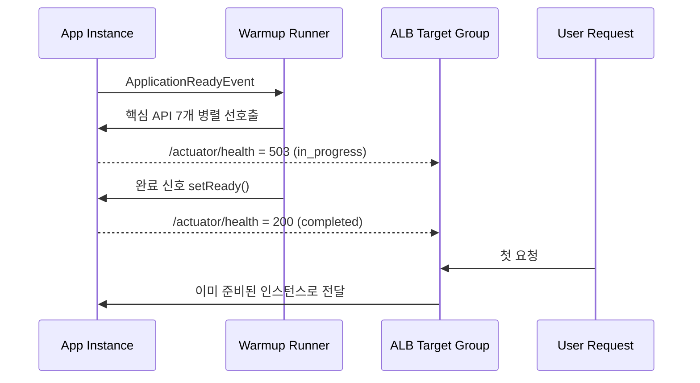

> 핵심은 최적화가 아니라 시점 이동이었다. 첫 사용자 요청이 내던 초기화 비용을 배포 직후 Warmup 구간으로 옮겼다.

---

## JVM 기반 앱은 첫 요청이 느리다

JVM은 실행 시점에 비용을 지불하는 구조다. 클래스 파일은 처음 참조될 때 로딩되고, 바이트코드는 인터프리터로 먼저 실행된 후 JIT 컴파일러가 점진적으로 기계어로 변환한다. Spring Boot 기반 앱에서는 여기에 DispatcherServlet 초기화, Hibernate 쿼리 계획 생성, 커넥션 풀 확장 비용이 더해진다.

이 비용은 "앱이 느리다"와 다르다. 앱 시작 직후 단 한 번만 발생하고, 두 번째 요청부터는 사라진다. 문제는 그 "단 한 번"이 첫 번째 사용자 요청에서 터진다는 점이다.

---

## 우리 서비스에서 확인한 문제

배포 직후 첫 요청과 두 번째 요청의 응답시간을 비교했다.

```text
첫 /api/v1/home 요청: 3,447ms
두 번째 /api/v1/home 요청: 315ms
```

같은 API가 바로 다음 호출에서 315ms로 내려온다는 건, 비즈니스 로직 자체가 3초대라는 뜻이 아니다. 초기화 비용이 첫 사용자 요청에 실려 나간 것이다.

운영 관점에서 질문을 세 가지로 좁혔다.

1. Spring Boot `Started` 로그 이후에 아직 끝나지 않은 초기화는 무엇인가?
2. 그 비용을 사용자 요청 전에 미리 소진할 수 있는가?
3. 소진 과정에서 장애 전파를 만들지 않는가?

---

## `Started`와 "첫 요청 준비 완료"는 다르다

`Started ...`는 Spring Context가 올라왔다는 신호다.
하지만 첫 요청이 통과하는 전체 경로가 이미 따뜻하다는 의미는 아니다.

첫 요청에서 추가로 붙는 비용은 보통 아래에서 발생한다.

| 구간 | 첫 요청에서 붙는 비용 |
|------|-----------------------|
| 클래스 로딩 | 처음 참조되는 QueryDSL/Jackson/AOP 관련 클래스 로딩 |
| DispatcherServlet | 핸들러 매핑/인터셉터 체인 초기화 |
| Hibernate | SQL 변환 계획/엔티티 매핑/프록시 준비 |
| HikariCP | 추가 커넥션 생성, 핸드셰이크 |
| JIT | 인터프리터 실행 -> C1 컴파일 전환 |

결론은 명확했다.
"기동 완료"와 "사용자 요청에 대한 성능 준비 완료"를 분리해서 다뤄야 한다.

---

## 우리가 선택한 방식: Warmup + Health Gate

대안은 세 가지가 있었다.

| 대안 | 장점 | 단점 | 최종 판단 |
|------|------|------|-----------|
| 아무 처리 없음 | 구현 비용 없음 | 첫 사용자 요청에 콜드 스타트 노출 | 미채택 |
| 전역 eager 초기화 | 일부 초기화 선반영 | 기동 시간 급증, 불필요한 리소스 선점 | 미채택 |
| Warmup + Health Gate | 사용자 유입 전 선초기화 가능, 실패 범위 통제 가능 | Warmup 시나리오 관리 비용 | 채택 |

채택 이유는 "가장 빠른" 방법이라서가 아니다.
장애 영향 범위를 Warmup 단계에 가두고, 사용자 요청 경로에서 콜드 스타트를 제거할 수 있었기 때문이다.

---

## 동작 흐름

아래 순서로 트래픽 유입 시점을 제어했다.



핵심은 두 가지다.

1. Warmup이 끝나기 전에는 Target Group 편입을 막는다.
2. Warmup 실패가 전체 기동 실패로 번지지 않게 timeout/fail-open 정책을 둔다.

---

## 구현 포인트

### 1) Warmup 트리거

Warmup은 `ApplicationReadyEvent` 직후 시작했다.
실제 요청 경로를 통과시키기 위해 핵심 API를 병렬 호출했다.

```kotlin
@EventListener(ApplicationReadyEvent::class)
fun onReady(event: ApplicationReadyEvent) {
    runBlocking {
        runCatching {
            withTimeout(30_000L) {
                listOf(
                    asyncIO { componentController.getComponents(userId = null) },
                    asyncIO { componentController.getLatestProducts(...) },
                    asyncIO { categoryController.getCategoriesByParent(parentCategoryId = 0) },
                    asyncIO { searchController.getAutoComplete(keyword = "a", limit = 10) },
                    asyncIO { searchController.searchProducts(ControllerSearchProductRequest(userId = 0)) },
                    asyncIO { popupController.getActivePopupList(page = 0, size = 10) },
                    asyncIO { productController.getRecommendedProducts(page = 0, size = 20, userId = null) },
                ).awaitAll()
            }
        }
    }
    warmupState.setReady()
}
```

여기서 중요한 건 "몇 개를 호출했는가"보다 "실제 핫패스를 통과했는가"다.
실서비스에서 자주 타는 조회 경로를 고정해 두어야 Warmup 가치가 생긴다.

### 2) Health Gate

웜업 상태를 Health 응답에 직접 반영했다.

```kotlin
@GetMapping("/actuator/health")
fun actuatorHealth(): ResponseEntity<Map<String, String>> {
    return if (warmupState.isReady()) {
        ResponseEntity.ok(mapOf("status" to "UP", "warmup" to "completed"))
    } else {
        ResponseEntity.status(HttpStatus.SERVICE_UNAVAILABLE)
            .body(mapOf("status" to "DOWN", "warmup" to "in_progress"))
    }
}
```

이렇게 하면 LB가 Warmup 완료 전 인스턴스를 트래픽 대상에서 제외한다.
"첫 사용자가 워밍업을 대신 해주는" 상황을 구조적으로 막는다.

### 3) 실패 처리

Warmup은 성능 최적화 단계다.
가용성을 깨뜨리는 하드 게이트가 되면 안 된다.

- timeout: 30초
- 실패 정책: 로그 남기고 진행(fail-open)
- 상태 전환: 마지막에 `setReady()` 실행

즉, 완벽한 워밍업보다 서비스 지속성이 우선이다.

---

## Warmup 5.2초 동안 JVM에서 실제로 일어난 일

### A. 클래스 로딩 비용 선흡수

첫 호출 전에는 관련 클래스가 아직 메모리에 없다.
Warmup이 먼저 호출하면 클래스 로딩/검증 비용을 Warmup이 가져간다.

| 구간 | Warmup 전 첫 사용자 요청 | Warmup 후 첫 사용자 요청 |
|------|--------------------------|---------------------------|
| `/api/v1/home` 총 응답 | 3,447ms | 249ms |
| `ComponentServiceImpl.getHome` | 432ms | 2ms |
| `findActiveComponentBanners` | 980ms | ~17ms |
| `findActiveComponentsBySection` | 591ms | 17ms |

### B. DispatcherServlet 초기화 시점 이동

DispatcherServlet은 첫 HTTP 요청 시 초기화되는 비용이 있다.
Warmup이 먼저 경로를 타면, 사용자 요청에는 이 비용이 붙지 않는다.

### C. Hibernate 메타데이터/쿼리 계획 캐시 선생성

첫 실행 시 Hibernate는 SQL 변환 계획, 엔티티 매핑, 프록시 준비를 수행한다.
Warmup은 이 과정을 선반영해 두 번째 호출부터 캐시 히트를 만든다.

### D. HikariCP 확장 커넥션 선생성

풀 시작 직후에는 최소 연결만 열린 상태인 경우가 많다.
Warmup 병렬 호출로 DB 접근이 발생하면 추가 커넥션이 미리 만들어지고, 요청 경로의 대기 시간을 줄인다.

### E. JIT 초기 구간 단축

JVM은 메서드를 처음에는 인터프리터로 실행한다. 호출 횟수가 일정 임계치를 넘으면 JIT 컴파일러가 기계어로 변환한다.

이 과정은 두 단계로 진행된다. C1 컴파일러가 먼저 동작한다. 빠르게 컴파일하지만 최적화 수준은 낮다. 메서드가 약 1,500회 호출되면 C1이 개입한다. 이후 호출 횟수가 약 10,000회를 넘으면 C2 컴파일러가 더 공격적인 최적화(인라이닝, 루프 최적화, 이스케이프 분석 등)를 적용해 재컴파일한다.

Warmup이 각 API를 1회 호출하는 것만으로 C2까지 올라가지는 않는다. 하지만 인터프리터 → C1 전환을 앞당기는 효과가 있다. 첫 사용자 요청이 순수 인터프리터 모드로 실행되는 최악의 시나리오를 방지하는 것이다.

---

## 결과 수치와 해석

### 측정 조건

| 항목 | 값 |
|------|----|
| 환경 | ECS + ALB Health Check |
| Warmup 대상 | 주요 조회 API 7개 |
| Warmup 실행 시점 | ApplicationReadyEvent 직후 |
| 트래픽 유입 제어 | Warmup 완료 전 `/actuator/health` 503 |

### 결과

```text
Before: 첫 /api/v1/home 3,447ms
After : 첫 /api/v1/home   249ms
```

- Warmup 소요: 약 5.2초
- Ready 총 시간: 131.6초 -> 132.0초 (소폭 증가)

해석은 이렇다.
기동 전체 시간은 거의 유지하면서, 사용자에게 노출되던 초기화 비용을 배포 직후 구간으로 옮겼다.

---

## Warmup과 AppCDS는 역할이 다르다

둘 다 "초기화 비용"을 다루지만 타깃이 다르다.

| 기법 | 줄이는 비용 | 작동 시점 |
|------|-------------|-----------|
| AppCDS | 클래스 파싱/검증 일부 | JVM 시작 시 |
| Warmup | 요청 경로 초기화(서블릿/ORM/풀/JIT 초반) | 앱 Ready 직후 |

즉, AppCDS는 "JVM 부팅 비용" 최적화에 가깝고,
Warmup은 "첫 사용자 요청 비용" 최적화에 가깝다.

---

## 적용하면서 확인한 한계

1. Warmup 대상 API가 계속 바뀌면 유지비가 커진다.
2. 외부 API 의존 경로를 무분별하게 넣으면 Warmup 자체가 장애 전파 지점이 된다.
3. 항상 고트래픽인 서비스는 자연 워밍이 빨라 체감 이득이 작을 수 있다.
4. Warmup 성공률/소요시간 지표를 모니터링하지 않으면 효과가 유지되는지 판단하기 어렵다.

그래서 운영에서는 아래를 고정했다.

- 핵심 API 목록을 버전 관리
- Warmup 성공/실패/소요시간 로그 표준화
- 월 단위로 Warmup 대상 재검토

---

## 실무 체크리스트

1. 첫 요청이 느린 API를 1개 먼저 고른다.
2. 해당 경로가 실제 핫패스인지 확인한다.
3. `ApplicationReadyEvent` + timeout + fail-open으로 Warmup 구현한다.
4. Health Gate를 붙여 Warmup 전 트래픽 유입을 차단한다.
5. Before/After를 같은 조건에서 반복 측정한다.
6. 효과가 확인되면 API 범위를 단계적으로 확장한다.

---

## 정리

이번 개선은 "성능 튜닝 기교"보다 운영 설계에 가까웠다.
Warmup은 비용을 제거하는 기술이 아니라 비용이 터지는 시점을 옮기는 기술이다.

첫 사용자 요청이 초기화 비용을 부담하지 않게 만들고 싶다면,
Warmup 로직 자체보다 Health Gate와 실패 정책부터 먼저 설계하는 편이 안전하다.

---

## 참고 자료

- Spring Boot Application Events: https://docs.spring.io/spring-boot/reference/features/spring-application.html#features.spring-application.application-events-and-listeners
- Spring Boot Actuator Endpoints: https://docs.spring.io/spring-boot/reference/actuator/endpoints.html
- Spring Boot Availability & Probes: https://docs.spring.io/spring-boot/reference/actuator/endpoints.html#actuator.endpoints.kubernetes-probes
- ALB Target Group Health Checks: https://docs.aws.amazon.com/elasticloadbalancing/latest/application/target-group-health-checks.html
- HikariCP Configuration: https://github.com/brettwooldridge/HikariCP#configuration-knobs-baby
- Java HotSpot VM Performance Enhancements: https://docs.oracle.com/en/java/javase/21/vm/java-hotspot-virtual-machine-performance-enhancements.html
