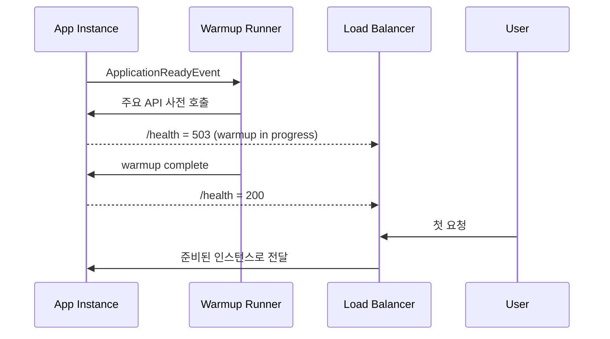

> 배포 직후 첫 요청이 느린 이유를 JVM 초기화 단계로 분해하고, Warmup 적용 시 지연이 어떻게 이동하는지 측정 조건과 함께 정리한다.

---

## 문제 상황

배포 직후 첫 API 응답이 3.5초 수준으로 나왔다. 같은 API의 두 번째 요청은 300ms 안쪽이어서, 코드 경로 자체가 무거운 상황은 아니었다. 로그에는 `Started in 127 seconds`가 찍혔지만, 사용자 체감은 달랐다. 저희는 "기동 완료"와 "첫 요청 준비 완료"를 분리해서 봐야 한다고 판단했다.

```text
Spring Boot Ready 이후 31분 대기
-> 첫 요청 /api/v1/home: 3,447ms
-> 두 번째 요청 /api/v1/home: 315ms
```

이 글은 세 가지를 답한다. 첫째, 왜 `Started` 이후에도 첫 요청이 느린가. 둘째, Warmup이 어떤 초기화 비용을 선반영하는가. 셋째, 이 방법이 유효한 조건과 한계는 무엇인가.

---

## 측정 조건

아래 조건에서 Before/After를 비교했다. 조건이 바뀌면 수치도 바뀔 수 있으므로, 재현 시 같은 축을 맞추는 게 좋다. 수치는 단일 샘플이 아니라 동일 경로 반복 측정값을 기준으로 기록했다.

| 항목 | 값 |
|------|----|
| 서비스 | Spring Boot API 서버 |
| 대상 API | `/api/v1/home`, `/api/v1/popups` |
| 환경 | ECS + ALB Health Check |
| Warmup 대상 | 주요 조회 API 7개 |
| Warmup 실행 시점 | `ApplicationReadyEvent` 직후 |
| 트래픽 유입 제어 | Warmup 완료 전 `/actuator/health` = 503 |

---

## 동작 방식: 왜 첫 요청이 느려지는가

Spring Boot Startup이 끝나도 모든 준비가 끝난 것은 아니다. 런타임에서 처음 호출될 때 만들어지는 객체와 캐시가 남아 있다. 이 비용이 첫 사용자 요청에 몰리면, 첫 요청만 유난히 느리게 보인다. 문제를 줄이려면 "초기화 비용의 실행 시점"을 바꿔야 한다.

### 단계 1. Startup 구간에서 끝나는 일

Startup 구간에서는 Bean 등록, DataSource 준비, Tomcat 기동 같은 공통 작업이 처리된다. 이 단계는 서비스가 살아 있는지를 판단하는 데는 충분하다. 다만 실제 요청 경로의 세부 초기화까지 모두 포함하지는 않는다. 그래서 `Started` 로그만으로 첫 요청 성능을 예측하기 어렵다.

### 단계 2. 첫 요청에서 새로 발생하는 일

첫 요청 시점에는 QueryDSL 경로, Hibernate 메타데이터, DispatcherServlet 경로에서 초기화가 추가로 일어난다. DB 커넥션도 최소 1개에서 확장되는 과정이 붙는다. 핫 메서드는 인터프리터 모드에서 시작해 초기 JIT 구간을 거친다. 이 조합이 첫 요청 지연을 만든다.

| 초기화 항목 | 첫 요청에서의 영향 |
|------------|--------------------|
| 클래스 로딩 | QueryDSL/Jackson/AOP 관련 클래스 최초 로딩 |
| Hibernate 준비 | SQL 변환 계획, 매핑 메타데이터, 프록시 준비 |
| DispatcherServlet | 핸들러/인터셉터 체인 초기화 |
| DB 커넥션 확장 | 커넥션 생성 및 핸드셰이크 비용 |
| 초기 JIT | 자주 쓰는 메서드의 초기 컴파일 구간 |

### 단계 3. Warmup으로 비용 시점 이동

Warmup은 사용자 대신 시스템이 먼저 API를 호출한다. 핵심은 Health Check와 묶어서 사용자 유입 시점을 늦추는 것이다. 즉, 비용을 없애는 방식이 아니라 비용을 먼저 지불하는 방식이다. 이 구조가 첫 요청 지연을 줄인다.



---

## 구현 방식

Warmup 구현은 복잡하지 않다. `ApplicationReadyEvent`에서 주요 API를 병렬 호출하고, 완료 시점에 `WarmupState`를 올리면 된다. 실패를 전체 기동 실패로 전파하지 않도록 타임아웃과 예외 처리를 둔다. 이 구성이 운영 안정성과 성능 사이의 균형점이었다.

아래 코드는 Warmup을 트리거하는 예시다. 핵심은 이벤트 시점과 실패 처리 정책이다. 코드 길이보다 제어 흐름을 먼저 보는 편이 이해에 도움이 된다.

```kotlin
@Component
class AppWarmup(
    private val componentController: ComponentController,
    private val categoryController: CategoryController,
    private val searchController: SearchController,
    private val popupController: PopupController,
    private val productController: ProductController,
    private val warmupState: WarmupState,
) {
    @EventListener(ApplicationReadyEvent::class)
    fun onReady(event: ApplicationReadyEvent) {
        runBlocking {
            runCatching {
                withTimeout(WARMUP_TIMEOUT_MS) {
                    listOf(
                        asyncIO { componentController.getComponents(userId = null) },
                        asyncIO { componentController.getLatestProducts(...) },
                        asyncIO { categoryController.getCategoriesByParent(parentCategoryId = 0) },
                        asyncIO { searchController.getAutoComplete(keyword = "a", limit = 10) },
                        asyncIO { searchController.searchProducts(...) },
                        asyncIO { popupController.getActivePopupList(page = 0, size = 10) },
                        asyncIO { productController.getRecommendedProducts(...) },
                    ).awaitAll()
                }
            }
        }
        warmupState.setReady()
    }
}
```

이 코드는 7개 경로를 병렬로 호출해 Warmup 시간을 제한한다. 타임아웃이 발생해도 프로세스 전체를 중단하지 않는다. 대신 Health 상태를 통해 트래픽 유입 시점을 제어한다. 운영에서는 "실패를 숨기지 않되, 실패 범위를 좁히는" 구성이 더 안전했다.

Health Check 연동 코드는 다음과 같다. 이 코드는 Warmup 상태를 외부에 노출하는 역할을 한다. 운영에서는 이 신호가 트래픽 유입 시점을 결정한다.

```kotlin
@GetMapping("/actuator/health")
fun actuatorHealth(): ResponseEntity<Map<String, String>> {
    return if (warmupState.isReady()) {
        ResponseEntity.ok(mapOf("status" to "UP", "warmup" to "completed"))
    } else {
        ResponseEntity.status(HttpStatus.SERVICE_UNAVAILABLE)
            .body(mapOf("status" to "DOWN", "warmup" to "in_progress"))
    }
}
```

이 방식의 목적은 단순하다. Warmup이 끝나기 전에는 Target Group 편입을 막는다. 그래서 사용자 첫 요청이 초기화 비용을 직접 부담하지 않는다. 운영 장애를 줄이는 데는 이 제어가 핵심이었다.

---

## 선택 과정

Warmup을 바로 선택하지는 않았다. 먼저 대안을 같은 기준으로 비교했다. 비교 기준은 "첫 요청 품질", "실패 영향 범위", "구현 복잡도"였다.

| 대안 | 장점 | 단점 | 채택 여부 |
|------|------|------|-----------|
| 아무 처리 안 함 | 구현 비용 0 | 첫 요청 지연이 사용자에게 노출됨 | 미채택 |
| 전역 eager 초기화 | 초기화 선반영 가능 | 기동 시간 증가, 불필요한 리소스 선점 | 미채택 |
| Warmup + Health Gate | 사용자 유입 전 선초기화 가능 | Warmup 시나리오 유지 비용 필요 | 채택 |

최종 선택은 Warmup + Health Gate였다. 첫 요청 지연을 숨기는 것이 아니라, 사용자 앞에서 발생하지 않게 옮길 수 있었기 때문이다. 또한 실패 시 영향 범위를 Warmup 단계에 묶을 수 있었다. 이 점이 운영 관점에서 유리했다.

---

## 결과와 해석

결과는 아래처럼 나왔다. 다만 이 수치는 현재 환경 조건에서의 관찰값이고, 동일 수치를 다른 시스템에 그대로 기대하면 안 된다. API 구조와 인프라 구성이 다르면 초기화 비용 분포도 달라진다.

```text
Before: 첫 /api/v1/home 3,447ms
After : 첫 /api/v1/home   249ms
```

| 메서드 | Before (첫 호출) | After (Warmup 후 첫 호출) |
|--------|------------------|----------------------------|
| `ComponentServiceImpl.getHome` | 432ms | 2ms |
| `findActiveComponentBanners` | 980ms | ~17ms |
| `findActiveComponentsBySection` | 591ms | 17ms |

Warmup 실행 시간은 약 5.2초였다. Ready 총 시간은 131.6초에서 132.0초로 소폭 증가했다. 즉, 전체 준비 시간 증가는 작았고 첫 요청 지연 감소 폭은 상대적으로 컸다. 저희는 이 트레이드오프를 수용 가능한 수준으로 판단했다.

---

## 적용 조건과 한계

다음 조건에서는 적용 가치가 높다. 배포 직후 첫 요청 지연이 SLA를 넘고, Health Gate를 제어할 수 있으며, 핫패스 API가 명확할 때다. 이런 서비스는 Warmup 시나리오를 고정하기 쉽다. 또한 개선 여부를 지표로 확인하기도 쉽다.

반대로 항상 고트래픽이라 자연 워밍이 빠른 시스템에서는 체감 이득이 작을 수 있다. Warmup 대상 API가 자주 바뀌는 시스템도 유지 비용이 커질 수 있다. 외부 의존성까지 Warmup에 넣어야 하면 장애 전파 위험을 따로 관리해야 한다. 그래서 도입 전에 대상 경로와 실패 정책을 먼저 정하는 편이 안전하다.

---

## 정리

이 작업의 본질은 "최적화 기능 추가"가 아니었다. 사용자 요청에서 발생하던 초기화 비용을 준비 단계로 이동한 것이 핵심이었다. Warmup은 만능 해법이 아니라, 조건이 맞을 때 효과가 큰 운영 전략에 가깝다. 도입 전에는 대상 API, Health Gate, 실패 정책을 같이 설계하는 것을 권한다.

비슷한 상황을 운영 중이라면, 먼저 첫 요청 지연 API 1개만 골라서 실험해 보시는 것을 권한다. 측정 조건을 고정하고 Before/After를 같은 방식으로 기록하면 판단이 쉬워진다. 필요하시면 다음 글에서 체크리스트 형식으로 실험 절차를 이어서 정리하겠다.
