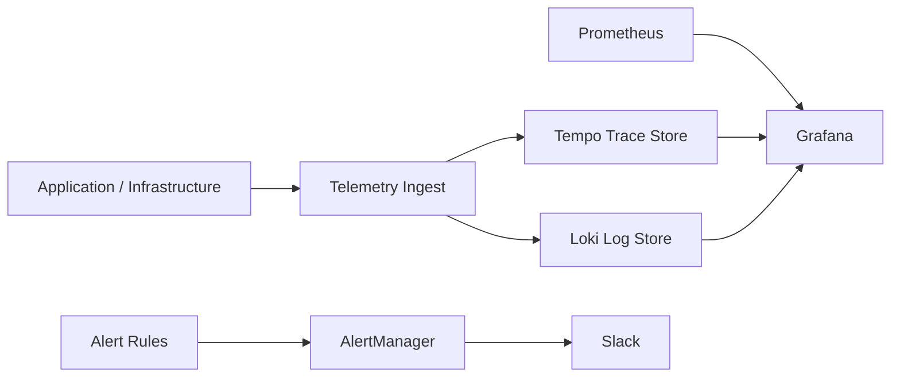
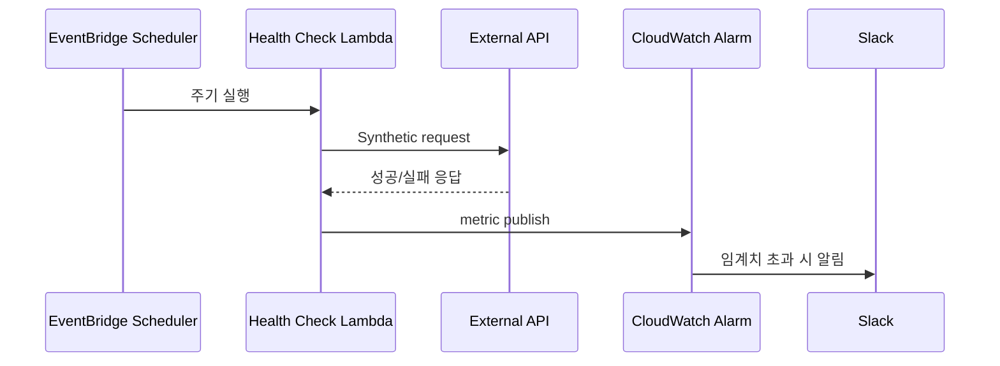

> 이번 결정의 핵심은 도구 선호가 아니라 장애 중에도 관측이 끊기지 않는 구조를 만드는 일이었다.

---

## 문제 상황을 정확히 정의했다

초기 운영에서는 메트릭, 로그, 트레이스를 확인하는 경로가 분리되어 있었다.
장애가 터지면 "어디서부터 봐야 하는지"부터 정리해야 했고, 그 사이 분석 시간이 늘어났다.

여기에 비용 제약이 동시에 있었다.
트래픽 증가 시 모니터링 비용의 상한을 예측할 수 있어야 했다.

요구사항은 두 가지였다.

1. 장애 분석 리드타임을 줄일 것
2. 월간 운영비를 예측 가능한 범위로 유지할 것

---

## 제약 조건

아키텍처를 고르기 전에 먼저 못 바꾸는 조건을 고정했다.

| 제약 | 설명 |
|------|------|
| 관측 연속성 | 일부 컴포넌트 장애 시에도 최소 관측 경로 유지 필요 |
| 외부 의존성 | 결제/메시징 등 외부 API 장애를 내부 지표만으로는 조기 탐지 어려움 |
| 비용 통제 | 보관 기간/데이터량 증가에 따른 비용 상한 필요 |
| 운영 인력 | 고급 운영 전담팀 없이도 유지 가능한 복잡도여야 함 |

이 제약을 기준으로 대안을 비교했다.

---

## 대안 비교

### 후보 1: 상용 SaaS 중심

장점은 초기 진입 장벽이 낮다는 점이다.
구성 속도가 빠르고 운영 포인트가 상대적으로 적다.

단점은 장기 비용과 보관 정책 제어다.
트래픽과 보관 기간이 늘면 월 비용 변동폭이 커질 수 있다.

### 후보 2: Hybrid LGTM

장점은 제어권이다.
메트릭/로그/트레이스 저장 정책, 보관 기간, 경로 설계를 서비스 특성에 맞출 수 있다.

단점은 운영 복잡도 증가다.
배포, 스토리지 정책, 알림 규칙, 런북 관리가 필요해진다.

### 비용 비교(동일 기준)

| 항목 | Hybrid LGTM | 비교안 |
|------|-------------|--------|
| 월 비용(동일 가정) | 약 `$303/월` | 약 `$1,257/월` |

비용만으로 결정을 내리지는 않았다.
다만 장기 운영에서 4배 이상 차이가 나는 구조는 무시하기 어려웠다.

---

## 최종 선택: Hybrid LGTM + HA + 외부 API 헬스체크 분리

세 가지를 묶어서 설계했다.

1. Hybrid LGTM
2. HA 구성(memberlist 기반)
3. 외부 API 전용 헬스체크 경로

이 조합을 선택한 이유는 "탐지 속도"와 "관측 연속성"을 동시에 충족했기 때문이다.

---

## 아키텍처 구조

### 1) Control Plane과 Data Plane 분리

아래처럼 경로를 분리했다.

이 구조의 목적은 한 지점 장애가 전체 관측 불능으로 확산되는 걸 줄이는 데 있다.

### 2) HA 적용

단일 인스턴스 의존 구조에서는 저장소/쿼리 컴포넌트 장애가 곧 관측 단절로 이어진다.
그래서 Tempo/Loki를 memberlist 기반으로 분산 구성했다.

| 환경 | HA 적용 | 복제 전략 |
|------|---------|-----------|
| Prod | 활성화 | 복제 강화, 관측 연속성 우선 |
| Staging | 활성화(검증 중심) | 최소 복제로 비용 통제 |

핵심은 "평시 성능 최고치"보다 "장애 중 최소 관측 경로 유지"다.

### 3) 외부 API 헬스체크 분리

내부 애플리케이션 헬스만으로는 외부 API 이상을 빠르게 감지하기 어렵다.
내부 `/health`가 정상이어도 외부 결제 API가 실패할 수 있기 때문이다.

그래서 외부 API 전용 탐지 경로를 분리했다.

이 분리를 통해 "고객 문의 이후 인지"에서 "사전 인지"로 탐지 시점을 앞당겼다.

---

## 왜 이렇게 동작해야 했는가

### 원인 1. 장애 상황에서는 단일 관측 경로가 먼저 끊긴다

장애가 발생하면 보통 애플리케이션만 흔들리는 게 아니다.
로그 파이프라인, 쿼리 저장소, 알림 경로가 같이 영향을 받는다.

그래서 모니터링 시스템 자체도 부분 장애를 전제로 설계해야 한다.

### 원인 2. 내부 지표만 보면 외부 실패를 놓친다

`5xx`, CPU, 메모리만 보면 내부 서비스는 정상처럼 보일 수 있다.
하지만 결제/메시징 API가 부분 장애면 실제 사용자 경험은 이미 나빠져 있다.

외부 API는 별도 synthetic check가 필요하다.

### 원인 3. 비용은 순간값이 아니라 성장곡선으로 봐야 한다

모니터링 비용은 트래픽과 보관 기간이 같이 증가할 때 급격히 커질 수 있다.
초기 월비용만 비교하면 장기 의사결정이 틀어지기 쉽다.

그래서 이번 결정에서는 "현재 비용"보다 "증가 시 상한 예측 가능성"을 우선했다.

---

## 운영 관점에서 얻은 것

1. 로그/트레이스 상호 추적 경로가 짧아져 RCA 시작 시간이 줄었다.
2. 보관 정책을 서비스 특성에 맞게 조정해 비용 예측 가능성이 높아졌다.
3. 외부 API 장애를 내부 장애와 분리해 경보 품질이 개선됐다.
4. 알림 기준을 명확히 분리해 노이즈를 줄였다.

---

## 운영 관점에서 감수한 것

1. IaC/배포/알림 규칙 관리 포인트가 늘었다.
2. 팀 내 구조 이해 비용이 증가했다.
3. 런북이 없으면 알림 대응 편차가 크게 벌어진다.
4. 장애 훈련을 하지 않으면 HA 설계 의도가 운영에서 사라진다.

그래서 구조 도입과 동시에 아래를 고정했다.

- 알림 라우팅 표준
- 장애 분류 기준(내부/외부/관측 경로)
- 온콜 대응 런북

---

## 도입 순서(실무형)

1. 먼저 "무엇을 포기할지" 결정한다.
2. 관측 연속성이 우선이면 HA를 먼저 넣고, 초기 단순성이 우선이면 단일 구성으로 시작한다.
3. 내부 헬스와 외부 의존성 헬스를 분리한다.
4. 비용 비교는 월 총액만 보지 말고 보관 기간/데이터 증가율까지 같이 본다.
5. 마지막에 도구를 선택한다.

구조를 먼저 정하고 도구를 고르면, 운영 중 방향 전환 비용이 훨씬 작다.

---

## 실패하기 쉬운 지점

1. 대시보드를 많이 만드는 데 집중하고 알림 설계를 늦추는 경우
2. 메트릭만 보고 외부 API synthetic check를 생략하는 경우
3. HA를 켰지만 장애 연습이 없어 실제 대응이 단일 경로처럼 동작하는 경우
4. 비용 비교를 초기 구간만 보고 보관 증가 시나리오를 빼는 경우

---

## 정리

이번 선택은 "최신 도구 도입"이 목적이 아니었다.
장애 중에도 관측이 유지되는 운영 구조를 먼저 고른 결과가 Hybrid LGTM + HA + 외부 API 헬스체크 분리였다.

운영 복잡도는 분명히 올라간다.
하지만 관측 연속성, 탐지 속도, 비용 예측 가능성을 동시에 만족하려면 구조적 분리가 필요했다.

---

## 참고 자료

- Grafana Loki: https://grafana.com/docs/loki/latest/
- Grafana Tempo: https://grafana.com/docs/tempo/latest/
- Prometheus: https://prometheus.io/docs/introduction/overview/
- Grafana Alerting: https://grafana.com/docs/grafana/latest/alerting/
- AWS EventBridge Scheduler: https://docs.aws.amazon.com/scheduler/latest/UserGuide/what-is-scheduler.html
- AWS Lambda: https://docs.aws.amazon.com/lambda/latest/dg/welcome.html
- AWS CloudWatch Alarms: https://docs.aws.amazon.com/AmazonCloudWatch/latest/monitoring/AlarmThatSendsEmail.html
