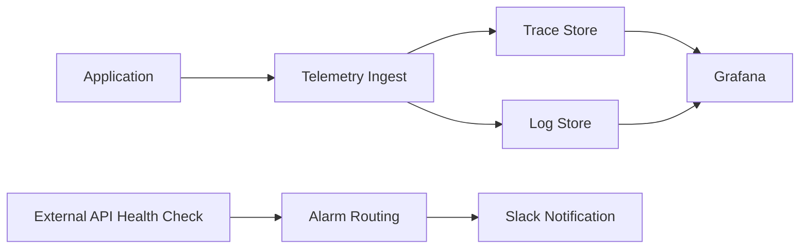

> 모니터링 시스템을 새로 구축할 때, "무엇을 쓸지"보다 "왜 그 구조를 택했는지"가 운영 안정성을 더 크게 좌우했습니다.

---

## 문제 상황

디어테일 프로젝트에서 모니터링을 재정비할 때 저희가 먼저 마주한 문제는 단순했습니다.
메트릭, 로그, 트레이스를 각각 따로 보는 구조로는 장애 원인을 끝까지 추적하기 어려웠습니다.
동시에 비용 상한도 분명해서, SaaS를 그대로 도입하는 선택은 부담이 있었습니다.

즉,
**관측성 품질과 비용 제약을 동시에 만족해야 하는 문제**
였습니다.

---

## 증상과 분석

저희는 먼저 대안을 두 가지로 나눴습니다.
하나는 상용 SaaS 중심 구성, 다른 하나는 오픈소스 기반 자체 운영 구성입니다.
그다음 비용, 보관 정책, 운영 제어권 관점에서 비교했습니다.

| 관점 | 상용 SaaS 중심 | Hybrid LGTM 중심 |
|------|----------------|------------------|
| 월간 비용(비교 문서 기준) | 상대적으로 높음 | 상대적으로 낮음 |
| 로그 보관 유연성 | 상품 정책 제약 있음 | 스토리지/라이프사이클 직접 제어 |
| 구성 제어권 | 제한적 | 높음 |
| 운영 복잡도 | 낮음 | 높음 |

분석 문서에서는 Savings Plan 기준 LGTM 월 비용이 약 `$303`, 비교 대상이 약 `$1,257`로 정리되어 있습니다.
물론 비용만으로 결정하면 안 되지만, 운영 지속성을 고려하면 무시하기 어려운 차이였습니다.

---

## 원인 파악

왜 기존 방식으로는 장애 대응 속도가 충분히 나오지 않았는지 따져보면 원인은 세 가지였습니다.

1. 로그와 트레이스의 조회 경로가 분리되어 "증상은 보이는데 원인이 늦게 보이는" 상황이 반복됐습니다.
2. 단일 구성 요소 장애가 전체 관측 파이프라인 지연으로 이어질 수 있었습니다.
3. 외부 API 사용 서비스 장애는 내부 지표만으로는 조기 인지가 어려웠습니다.

따라서 저희 결론은 명확했습니다.

**데이터 경로는 HA로, 탐지 경로는 외부 헬스체크로 보완해야 한다.**

---

## 해결 방법

### 1) Hybrid LGTM 아키텍처 선택

저희는 관리 평면과 데이터 평면을 분리했습니다.
Grafana/Prometheus/AlertManager는 운영 편의 중심으로 두고, 로그/트레이스 수집·저장은 트래픽 특성에 맞게 분리 배치했습니다.

### 2) HA(고가용성) 적용

HA는 "장애를 막기 위한 장식"이 아니라, 장애 상황에서 관측 자체가 끊기지 않게 하는 안전장치였습니다.
Tempo/Loki에 대해 memberlist 기반 Ring 구성을 적용하고, 환경별 복제 정책을 분리해 운영했습니다.

### 3) 외부 API 사용 서비스 헬스체크 알림 연동

내부 애플리케이션 상태만 보면 놓치는 구간이 있어서, 외부 API 사용 서비스에 대해 주기적 헬스체크를 분리했습니다.
EventBridge 스케줄러 → Lambda 체크 → CloudWatch Alarm → Slack 알림 흐름으로 구성해 "고객 문의 이전"에 인지 가능한 체계를 만들었습니다.

---

## 트레이드오프

이 선택의 단점도 분명했습니다.
구축 초기에 운영 복잡도와 설정 관리 포인트가 늘어났고, 팀이 아키텍처를 이해해야 하는 학습 비용도 발생했습니다.

반대로 장점은 더 명확했습니다.
비용 예측 가능성, 로그 보관 정책 유연성, 그리고 장애 시 추적 경로를 팀이 직접 통제할 수 있다는 점입니다.

| 선택 항목 | 얻은 것 | 감수한 것 |
|-----------|---------|-----------|
| Hybrid LGTM | 제어권, 유연성, 비용 안정성 | 운영 복잡도 증가 |
| HA 구성 | 관측 연속성 향상 | 구성/운영 난이도 증가 |
| 외부 헬스체크 | 조기 탐지 능력 향상 | 체크 로직 유지보수 필요 |

---

## 근거

- `documents/monitoring/docs/current/LGTM_ARCHITECTURE_TRADEOFF_ANALYSIS.md`
- `documents/monitoring/docs/current/LGTM_VS_WHATAP_COST_COMPARISON.md`
- `documents/monitoring/docs/current/PROD_STAGING_INFRA_STATUS.md`
- `documents/monitoring/docs/current/EXTERNAL_HEALTH_CHECK_GUIDE.md`

---

## 정리

- 저희는 모니터링 도구 선택을 "기능"보다 "운영 제약" 기준으로 결정했습니다.
- HA는 성능 최적화가 아니라 장애 시 관측 연속성을 위한 설계 선택이었습니다.
- 외부 API 사용 서비스 헬스체크는 내부 지표의 사각지대를 메우는 핵심 장치였습니다.

완벽한 정답은 없지만, 현재 팀 규모와 운영 조건에서는 이 선택이 가장 현실적인 균형점이었습니다.

혹시 여러분 팀에서는 모니터링 구성의 트레이드오프를 어떤 기준으로 우선순위화하고 계신가요?
