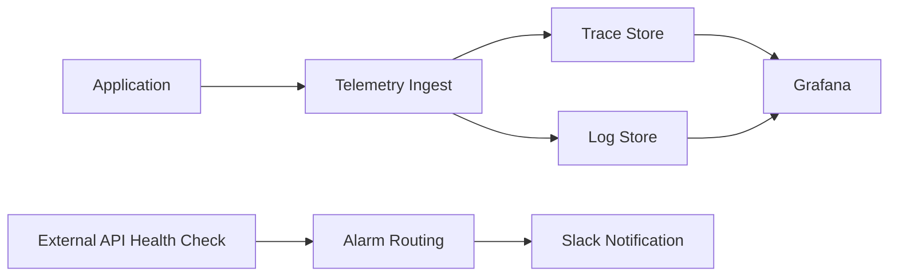

> 모니터링은 도구 선택보다 "장애 시에도 관측이 끊기지 않는 구조"를 먼저 설계해야 했다.

---

## 문제 상황

초기에는 메트릭, 로그, 트레이스를 보는 경로가 분리되어 있었다.
장애가 나면 "증상 확인"은 빨랐지만, 원인 추적은 느렸다.
동시에 비용 상한이 있어 상용 SaaS 단일 의존도 부담이 있었다.

요약하면 두 제약을 동시에 만족해야 했다.

1. 장애 분석 속도 개선
2. 월간 비용의 예측 가능성

---

## 의사결정 기준

아키텍처 선택 전에 기준을 먼저 고정했다.

| 기준 | 질문 |
|------|------|
| 관측 연속성 | 구성 요소 일부 장애 시에도 데이터 경로가 유지되는가 |
| 탐지 속도 | 내부 지표 사각지대(외부 API 장애)를 메울 수 있는가 |
| 비용 안정성 | 트래픽 증가에도 비용 상한을 예측할 수 있는가 |
| 운영 복잡도 | 팀이 감당 가능한 수준의 운영 난이도인가 |

---

## 선택 과정

### 대안 비교

| 대안 | 장점 | 단점 |
|------|------|------|
| 상용 SaaS 중심 | 초기 운영 난이도 낮음 | 보관 정책/비용 제어 제약 |
| Hybrid LGTM | 제어권, 보관 정책 유연성, 비용 예측성 | 운영 복잡도 증가 |

작성자 승인 후 공개한 비용 비교 수치 기준으로는, Savings Plan 적용 시 LGTM 약 `$303/월`, 비교안 약 `$1,257/월`로 차이가 컸다.
비용만으로 결정하지는 않았지만, 장기 운영 관점에서 무시하기 어려운 격차였다.

---

## 최종 아키텍처

### 1) Hybrid LGTM

관리 평면과 데이터 평면을 분리했다.

- 관리 평면: Grafana/Prometheus/AlertManager
- 데이터 평면: Loki/Tempo 수집·저장 경로

이 구조의 목적은 "한 지점 이슈가 전체 관측 불능으로 번지는 것"을 줄이는 것이다.

### 2) HA 적용

Tempo/Loki를 단일 인스턴스 의존에서 memberlist 기반 분산 구성으로 운영했다.
복제 정책은 환경별로 다르게 운영했다.

| 환경 | HA | 복제 정책 |
|------|----|-----------|
| Prod | 활성화 | 복제 강화 |
| Staging | 활성화(검증 중심) | 최소 복제로 비용 제어 |

핵심은 성능보다 "장애 중에도 최소 관측 경로 유지"다.

### 3) 외부 API 헬스체크 분리

내부 애플리케이션 헬스만으로는 외부 결제/메시징 API 장애를 조기에 잡기 어렵다.
그래서 외부 API 전용 경로를 분리했다.

- EventBridge Scheduler
- Lambda health check
- CloudWatch Alarm
- Slack 알림

이 흐름으로 "고객 문의 이후 인지"를 "사전 인지"로 바꿨다.

---

## 운영 관점 상세 트레이드오프

### 얻은 것

1. 로그/트레이스 상호 추적 경로가 짧아져 장애 분석 리드타임이 줄었다.
2. 보관 기간과 스토리지 정책을 서비스 특성에 맞게 조정할 수 있었다.
3. 외부 API 장애를 내부 장애와 분리해서 탐지할 수 있었다.

### 감수한 것

1. IaC/배포/알림 규칙 관리 포인트가 늘어났다.
2. 팀 내 아키텍처 이해 비용이 증가했다.
3. 운영 절차 표준화(런북/알림 규칙)가 없으면 복잡도가 빠르게 올라간다.

---

## 처음 읽는 사람을 위한 적용 순서

1. 먼저 "무엇을 포기할지"를 정한다.
2. 관측 연속성이 목표면 HA부터, 초기 단순성이 목표면 단일 구성을 먼저 선택한다.
3. 내부 헬스와 외부 의존성 헬스를 분리한다.
4. 비용표는 월간 총액뿐 아니라 보관 기간/데이터 증가율을 같이 본다.
5. 마지막에만 도구를 고른다.

---

## 정리

이번 선택의 본질은 "최신 도구 도입"이 아니라 "장애 시 관측이 끊기지 않는 운영 구조"였다.
Hybrid LGTM + HA + 외부 API 헬스체크 조합은 운영 복잡도를 늘리지만, 관측 연속성과 비용 제어를 동시에 가져갈 수 있는 현실적인 균형점이었다.

---

## 참고 자료

- Grafana Loki: https://grafana.com/docs/loki/latest/
- Grafana Tempo: https://grafana.com/docs/tempo/latest/
- Prometheus: https://prometheus.io/docs/introduction/overview/
- AWS EventBridge Scheduler: https://docs.aws.amazon.com/scheduler/latest/UserGuide/what-is-scheduler.html
- AWS Lambda: https://docs.aws.amazon.com/lambda/latest/dg/welcome.html
- AWS CloudWatch Alarms: https://docs.aws.amazon.com/AmazonCloudWatch/latest/monitoring/AlarmThatSendsEmail.html
- WhaTap Pricing: https://www.whatap.io/ko/pricing/
