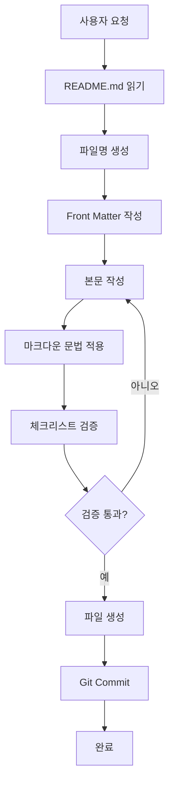

# 🤖 AI 에이전트를 활용한 블로그 글 작성 가이드

이 문서는 Claude Code, GitHub Copilot 같은 AI 에이전트를 활용해서 블로그 글을 자동으로 작성하는 방법을 설명합니다.

---

## 📖 시작하기 전에

AI 에이전트에게 다음과 같이 요청하세요:

```
_posts/README.md 파일을 읽고, 그 가이드에 맞춰서 새 블로그 글을 작성해줘.
```

또는

```
_posts 폴더의 README.md를 참고해서 [주제]에 대한 블로그 글을 작성해줘.
```

---

## 🎯 AI 에이전트 활용 시나리오

### 시나리오 1: 새 글 작성

**사용자 요청:**
```
README.md를 읽고, "Python 리스트 컴프리헨션"에 대한 블로그 글을 작성해줘.
파일명: 2025-11-23-python-list-comprehension.md
카테고리: 개발
태그: Python, 기초, 튜토리얼
```

**AI 에이전트가 할 일:**
1. `_posts/README.md` 파일 읽기
2. 파일명 규칙 확인 (YYYY-MM-DD-title.md)
3. Front Matter 템플릿 확인
4. 마크다운 문법 가이드 참고
5. 새 파일 생성: `_posts/2025-11-23-python-list-comprehension.md`
6. 올바른 형식으로 글 작성
7. 커밋 및 푸시

---

### 시나리오 2: 기존 글 수정

**사용자 요청:**
```
_posts/2024-11-21-welcome.md 파일을 읽고, README.md 가이드에 맞게 수정해줘.
- 목차 추가
- 태그 추가: Jekyll, 블로그, GitHub Pages
- 코드 블록에 언어 지정
```

**AI 에이전트가 할 일:**
1. 기존 파일 읽기
2. README.md의 Front Matter 가이드 참고
3. `toc: true` 추가
4. 태그 필드 추가
5. 코드 블록 수정
6. 변경사항 커밋

---

### 시나리오 3: 여러 글 일괄 작성

**사용자 요청:**
```
README.md를 참고해서 다음 주제로 3개의 글을 작성해줘:
1. Git 기초 사용법
2. JavaScript 비동기 프로그래밍
3. 클린 코드 작성 원칙

모두 "개발" 카테고리, 날짜는 오늘부터 3일 간격으로.
```

**AI 에이전트가 할 일:**
1. README.md 읽고 형식 파악
2. 3개 파일 생성:
   - `2025-11-23-git-basics.md`
   - `2025-11-26-javascript-async.md`
   - `2025-11-29-clean-code-principles.md`
3. 각 파일에 적절한 Front Matter 및 내용 작성
4. 일괄 커밋

---

## 📝 AI 에이전트를 위한 프롬프트 예시

### 예시 1: 기본 글 작성

```
_posts/README.md를 읽고 다음 조건으로 새 블로그 글을 작성해줘:

주제: Django REST Framework 시작하기
파일명: 2025-11-23-django-rest-framework-intro.md
카테고리: [개발]
태그: [Python, Django, DRF, API, Backend]
목차: 표시
본문 구성:
- 소개
- 설치 및 환경 설정
- 첫 API 만들기
- 테스트하기
- 마무리
```

### 예시 2: 시리즈 글 작성

```
README.md 가이드를 따라서 "React 입문" 시리즈 5편을 작성해줘:

1편: React 소개 (2025-11-23)
2편: 컴포넌트와 Props (2025-11-25)
3편: State와 생명주기 (2025-11-27)
4편: 이벤트 처리 (2025-11-29)
5편: 조건부 렌더링 (2025-12-01)

공통 설정:
- 카테고리: [개발]
- 태그: [React, JavaScript, Frontend, 시리즈]
- 목차 활성화
- 각 글에 이전/다음 글 링크 포함
```

### 예시 3: 템플릿 기반 작성

```
README.md를 읽고, 다음 정보로 "책 리뷰" 글을 작성해줘:

책 제목: 클린 코드
저자: 로버트 C. 마틴
파일명: 2025-11-23-clean-code-review.md
카테고리: [독서]
태그: [책, 리뷰, 클린코드, 개발]

본문 구조:
- 책 소개
- 인상 깊은 내용 3가지
- 실무 적용 사례
- 추천 대상
- 평점 및 총평
```

---

## 🔧 AI 에이전트 활용 체크리스트

AI 에이전트에게 글 작성을 요청할 때 다음 사항을 포함하세요:

### 필수 사항
- [ ] `_posts/README.md` 파일을 읽도록 명시
- [ ] 주제 또는 제목
- [ ] 파일명 (YYYY-MM-DD-title.md 형식)
- [ ] 카테고리
- [ ] 태그

### 선택 사항
- [ ] 본문 구성 (목차, 섹션 구조)
- [ ] 코드 예제 포함 여부
- [ ] 이미지 포함 여부
- [ ] 목차 표시 여부
- [ ] 특정 마크다운 스타일 요구사항

---

## 💡 AI 에이전트 활용 팁

### 1. 구체적으로 요청하기

❌ **나쁜 예:**
```
Python에 대한 글 써줘
```

✅ **좋은 예:**
```
README.md를 참고해서 "Python 데코레이터 완벽 가이드" 글을 작성해줘.
파일명: 2025-11-23-python-decorators.md
카테고리: [개발]
태그: [Python, 고급, 데코레이터]
본문에 코드 예제 3개 이상 포함하고, 실전 활용 사례도 추가해줘.
```

### 2. README.md 참조 강조

항상 프롬프트에 다음 문구를 포함:
```
_posts/README.md 파일을 읽고, 그 가이드의 형식을 정확히 따라줘.
```

### 3. 기존 글 스타일 참고

```
README.md와 _posts/2024-11-21-welcome.md를 읽고,
같은 스타일로 새 글을 작성해줘.
```

### 4. 검증 요청

```
글 작성 후, README.md의 체크리스트로 검증해줘.
```

---

## 🎓 고급 활용 예시

### 예시 1: 자동 SEO 최적화

```
README.md를 읽고 다음 조건으로 SEO 최적화된 글을 작성해줘:

주제: Next.js 14 새로운 기능
파일명: 2025-11-23-nextjs-14-features.md
카테고리: [개발]
태그: [Next.js, React, JavaScript, Web, Frontend]

추가 요구사항:
- 제목에 키워드 포함
- 소제목을 명확하고 구체적으로
- 코드 예제 각각에 주석 설명
- 요약 섹션 포함
- 관련 글 링크 3개 추가
```

### 예시 2: 다국어 글 작성

```
README.md를 읽고 "Docker 컨테이너 기초"에 대한 글을 한국어와 영어로 각각 작성해줘:

한국어 파일: 2025-11-23-docker-basics-ko.md
영어 파일: 2025-11-23-docker-basics-en.md

Front Matter에 언어 필드 추가:
language: ko 또는 en
```

### 예시 3: 인터랙티브 튜토리얼

```
README.md를 참고해서 "Git 인터랙티브 튜토리얼" 글을 작성해줘:

파일명: 2025-11-23-git-interactive-tutorial.md
카테고리: [개발]
태그: [Git, 튜토리얼, 실습, 버전관리]

특별 요구사항:
- 각 섹션마다 "따라하기" 단계 포함
- 각 명령어 설명 + 예제 + 예상 결과
- 흔한 에러 및 해결 방법 섹션
- 연습 문제 3개 포함
```

---

## 🚨 주의사항

### AI 에이전트가 지켜야 할 규칙

1. **파일명 규칙 준수**
   - 반드시 `YYYY-MM-DD-title.md` 형식
   - 날짜는 하이픈(`-`)으로 구분
   - 제목은 영문 소문자 + 하이픈

2. **Front Matter 필수 필드**
   ```yaml
   ---
   title: "필수"
   date: 2025-11-23 15:00:00 +0900  # 필수
   categories: [필수]
   tags: [선택이지만 권장]
   ---
   ```

3. **마크다운 문법 정확성**
   - 코드 블록에 언어 지정
   - 이미지 alt 텍스트 포함
   - 링크는 유효한 URL

4. **한국 시간대 사용**
   - 날짜 시간대는 항상 `+0900`

5. **목차 활용**
   - 긴 글(1000자 이상)은 `toc: true` 설정

---

## 📊 AI 에이전트 작업 플로우



---

## 🔍 문제 해결

### Q: AI가 README.md를 안 읽는 것 같아요

**해결:**
```
먼저 _posts/README.md 파일의 전체 내용을 읽어줘.
그 다음, 그 가이드에 맞춰서 [주제] 글을 작성해줘.
```

### Q: Front Matter 형식이 틀려요

**해결:**
```
README.md의 "Front Matter 필드 설명" 섹션을 정확히 따라서 작성해줘.
특히 날짜 형식과 배열 형식을 주의해줘.
```

### Q: 파일명이 규칙에 안 맞아요

**해결:**
```
파일명은 반드시 README.md의 "파일명 규칙" 섹션을 따라줘.
YYYY-MM-DD-title-in-english.md 형식으로.
```

---

## 📚 참고 자료

AI 에이전트가 추가로 참고하면 좋은 문서:
- `_posts/README.md` - 기본 글 작성 가이드
- `_posts/2024-11-21-welcome.md` - 실제 글 예시
- `_config.yml` - 블로그 전체 설정

---

## 🎯 실전 예제

### 전체 프롬프트 예시

```
안녕! _posts/README.md 파일을 먼저 읽어줘.

그 가이드를 정확히 따라서 다음 조건으로 새 블로그 글을 작성해줘:

제목: "FastAPI로 REST API 만들기"
파일명: 2025-11-23-fastapi-rest-api.md
카테고리: [개발]
태그: [Python, FastAPI, API, Backend, 튜토리얼]
목차: 표시 (toc: true, toc_sticky: true)

본문 구성:
1. FastAPI 소개
   - FastAPI가 무엇인지
   - 왜 FastAPI를 사용하는지

2. 환경 설정
   - Python 설치 (3.8+)
   - FastAPI 및 의존성 설치

3. 첫 번째 API 만들기
   - 기본 앱 구조
   - GET 엔드포인트 작성
   - POST 엔드포인트 작성
   - 각각 코드 예제 포함

4. API 테스트
   - Swagger UI 사용법
   - curl로 테스트하기

5. 마무리
   - 배운 내용 요약
   - 다음 단계 제안

요구사항:
- 모든 코드 블록에 언어 지정 (python, bash 등)
- 코드 예제는 실행 가능한 완전한 코드로
- 각 섹션마다 명확한 설명 추가
- 초보자도 이해할 수 있도록 작성

작성 완료 후:
- README.md의 체크리스트로 검증
- 검증 결과 보고
```

---

## ✅ AI 에이전트 검증 체크리스트

AI 에이전트가 글 작성 후 자체 검증할 항목:

```markdown
- [ ] README.md를 읽고 가이드를 이해했는가?
- [ ] 파일명이 YYYY-MM-DD-title.md 형식인가?
- [ ] Front Matter에 title과 date가 있는가?
- [ ] 날짜 형식이 YYYY-MM-DD HH:MM:SS +0900인가?
- [ ] categories와 tags를 설정했는가?
- [ ] 모든 코드 블록에 언어를 지정했는가?
- [ ] 이미지가 있다면 alt 텍스트를 포함했는가?
- [ ] 제목 구조가 올바른가? (H1 > H2 > H3)
- [ ] 맞춤법을 확인했는가?
- [ ] 링크가 유효한가?
```

---

## 🚀 시작하기

지금 바로 AI 에이전트에게 이렇게 요청해보세요:

```
_posts/README.md와 _posts/에이전트.md를 읽고,
[원하는 주제]에 대한 블로그 글을 작성해줘.
```

**Happy AI-Assisted Blogging! 🤖✨**
